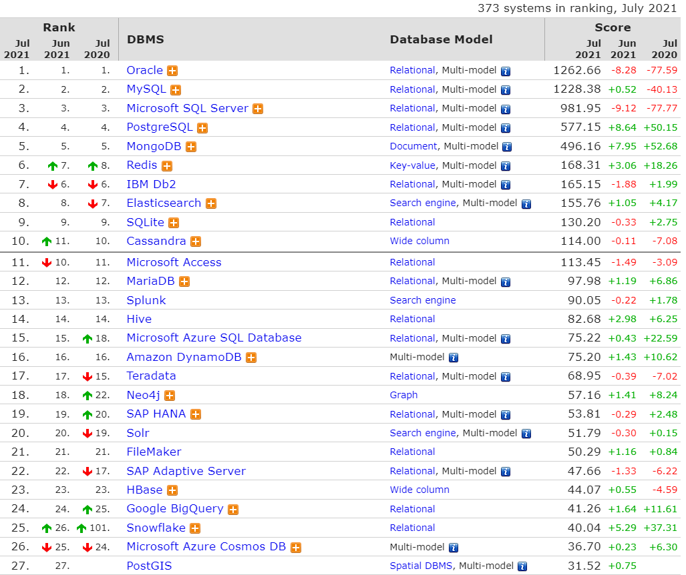
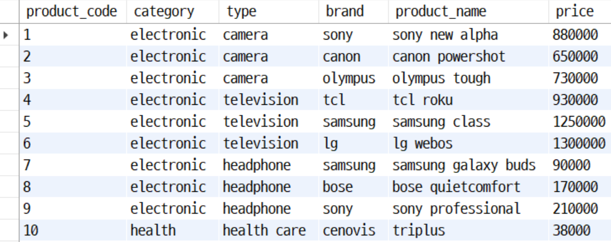
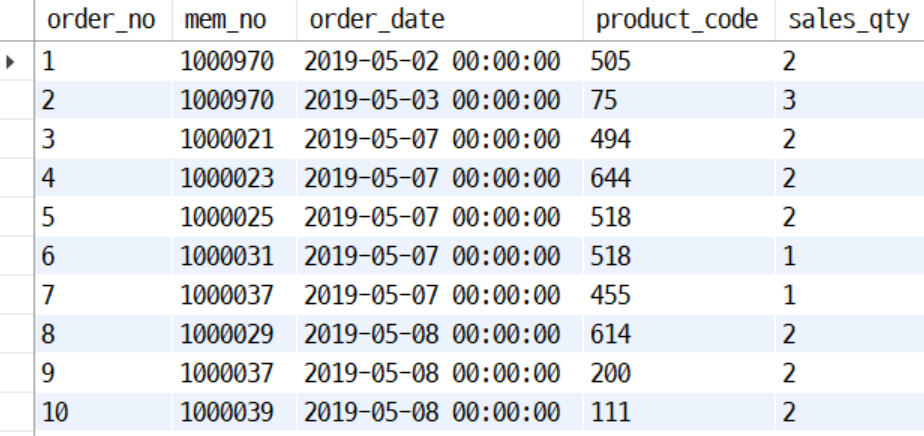

# COSADAMA - BASIC SQL WEEK1
작성자: 정찬, 이정윤 
참고자료: SQL/SB(MySQL)기본부터 파이썬/데이터분석 활용까지!(잔재미코딩), 부스트코드 1-1 SQL 및 관계형 데이터베이스(모원서), SQLite3로 가볍게 배우는 데이터베이스: SQL 기초 실습(최용)

### 0. SQL을 배우는 이유   

SQL을 배우는 이유를 알기 위해서는 우선 데이터 산업 전체에서 Database, DB조작의 역할에 대해서 알아야 합니다. 일반 개인은 데이터를 저장할 때, 편리하게 엑셀을 사용하곤 합니다. 그러나 기업은 수십만 혹은 그 이상의 모든 데이터를 엑셀로만 관리하기에는 한계가 있죠. 따라서 데이터 베이스는 대용량의 데이터를 저장, 검색, 수정 등 체계적인 관리를 하기 위해서 반드시 필요하고 이를 관리하는데 사용되는 프로그래밍 언어를 __SQL (Structured Query Language)__ 이라고 합니다.    

업무에 따라서 DB를 구축하는 일은 하지 않을 수 있지만, DB를 조작하고 다루는 방법을 숙지하고 있다면 보다 효율적인 일 처리를 진행할 수 있습니다. 따라서 본 스터디에서는 DB의 구성을 파악하기 위한 간단한 구축 방법과 DB조작법에 대해 공부할 예정입니다. 

##### [참고] 데이터 베이스의 장단점  

| 장점 | 단점 |
| ------ | ------ |
| 데이터 중복 최소화 | 데이터베이스 전문가 필요 |
| 데이터 공유 | 많은 비용 부담 |
| 일관성, 무결성, 보안성 유지 | 시스템의 복잡함 |
| 최신의 데이터 |  |
| 데이터의 표준화 가능 |  |
| 데이터의 논리적, 물리적 독립성 |  |
| 용이한 데이터 접근 |
| 데이터 저장 공간 절약|

전체적인 데이터 과학 분야에서 데이터를 수집하고 저장하는 작업은 초기 파트에 해당합니다. 이때까지 파이썬을 공부하면서 만들어진 데이터를 분석해서 인사이트를 찾거나, 시각화하는 작업 이전에 이루어지는 작업이라고 볼 수 있습니다. 

자! 이제 우리가 배울 MySQL에 대해서 살짝 알아봅시다. 
아래의 표는 2021년 기준 데이터 베이스 랭킹을 보여주는데, 관계형 데이터 베이스 (Relational Data Base Management System)계열의 **Oracle**(대용량 데이터 저장에 많이 사용되는 안전한 DB), **MySQL**(Oracle사에서 라이선스를 소유), RBDMS보다 덜 제한적인 형식을 가져 최근 빅데이터 시대와 함께 떠오르는 NoSQL 계열의 **Cassandra, MongoDB, Redis, Hive** 등 데이터 베이스 프로그램의 종류는 굉장히 다양합니다. 

이 중, 우리가 배울 **MySQL**은 대표적인 오픈소스 관계형 데이터 베이스 프로그램으로, 중소형 데이터를 저장하고 관리하기에 적합한 프로그램입니다. 
RDBMS계열에 속하는 데이터 베이스 프로그램들을 유사한 명령어들을 사용하기 때문에 표준 SQL 언어 하나를 공부하면 대부분 다룰 수 있습니다. 우리는 가장 대중적으로 사용되는 MySQL을 활용하여 데이터 베이스 공부를 진행할 예정입니다.

### 1. MySQL 다운로드 

동영상 강의에서 안내하는 순서대로 진행하면 됩니다. 
1.1 [Window OS](https://www.boostcourse.org/ds102/lecture/373285/?isDesc=false)
1.2 [Mac OS](https://www.boostcourse.org/ds102/lecture/373286/?isDesc=false)

### 2. 데이터베이스와 관계형 데이터베이스(RDBMS)에 대한 기초 설명
#### 2.1 DBMS
__DBMS__ 는 __DataBase Management System__ 의 약자로, 다수의 사용자들이 database의 데이터를 접근할 수 있는 소프트웨어 도구의 집합을 말합니다. 이때의 database는 대량의 정보를 컴퓨터가 효율적으로 접근할 수 있도록 가공 및 저장한 것 입니다. 그렇다면, DBMS를 사용하는 이유는 무엇일까요? DBMS는 다음과 같은 장점을 갖기 때문입니다.

1. 여러 사람이 데이터를 공유하기 쉽다.
2. 대량의 데이터를 다루기 쉽다.
3. 분석 툴(python 등)에서 읽기/쓰기 자동화 프로그래밍을 할 필요가 없다.
4. 보안, 백업이 용이하다

#### 2.2 RDB, RDBMS
__RDB__ 는 __Relational DataBase__ 의 약자로, __관계형 데이터베이스__ 를 말합니다. 관계형 데이터베이스는 key, value 값을 2차원 표(table or dataframe) 형식으로 나타내며, 하나의 database 안에 여러 테이블이 존재할 수 있습니다. 또한 테이블은 row(record)와 column으로 이루어져 있는데, 이때의 각 column은 특정 데이터 타입을 갖습니다. 데이터 타입에 대한 설명은 아래에서 진행하도록 하겠습니다. 
따라서, __RDBMS ((Relational Database Management System)__ 는 관계형 데이터베이스, 즉 RDB를 생성, 갱신, 관리하기 위한 시스템을 의미합니다. row(record) 단위로 데이터 읽기/쓰기가 이루어지며, 보통 데이터를 조작하는 클라이언트가 SQL 언어로 서버에 요청하면 서버가 처리해 2차원 표 형태의 데이터를 반환합니다.   

RDBMS의 종류는 앞서 SQL을 배우는 이유에서도 잠깐 언급했듯 굉장히 다양합니다. 종류들을 외우고 있어야 할 필요는 없지만, 알고 있으면 좋은 기초 지식이니 가볍게 읽고 넘어가면 됩니다. 
1. __oracle db__: rdbms의 역사라고 할 수 있음. 기술, 안정성이 뛰어나지만, 유료이므로 은행등 과 같이 안정성이 중요한 legacy한 업계에서 많이 사용딤.
2. __mysql__: 오픈소스로, 쉽다는 최대의 장점을 가짐. 웹, php 이용해 db를 구축할 때 많이 사용됨. 오라클이 인수한 후에는 비용을 부과할지 모른다는 생각 때문에 이전하는 경우가 있음.
3. __maria db__: 오픈 소스. mysql 기반으로 만들어져 비용 문제로부터 자유로움. 
4. __postgresql__:  버클리 대학의 오픈소스 ordbms. 객체-관계형 데이터 관리 시스템으로 더 풍부한 기능을 지원함. 
5. __sql server__: ms사에서 개발한 rdbms. 윈도우 환경 지원.
6. __sqlite__: db를 서버가 아닌 파일로 저장하는 dbms. 보통 기기 저장 공간에 간단하게 excel, csv 형태로 저장할 때 사용됨. 서버 이용은 안되지만 거창하게 사용하지 않을 때 유용함. 

#### 2.3 PRIMARY/FOREIGN KEY 
DB에서 사용하는 KEY는 기본적으로 TABLE의 열 (COLUMN)에 해당하며, 여러 종류가 있습니다. 이 키 전부를 아실 필요는 없지만, __PRIMARY, FOREIGN KEY의 관계__ 는 꼭 알아가시길 바랍니다.
- CANDIDATE KEY (후보키): TABLE의 COLUMN 중 유일하게 식별할 수 있는 열 (아직 KEY 아님)
- **PRIMARY KEY(기본키)**:  TABLE의 COLUMN 중 유일하게 식별하기 위해 사용하는 열(KEY).
    → 주민번호, 고객 번호, 제품 코드 등 유일한 값으로 이루어져 있다.
- ALTERNATE KEY(대체키):  기본키PK를 제외한후보키
- **FOREIGN KEY(외래키)**: 다른 TABLE의 기본키PK를 참조하는 열.

PRIMARY KEY와 FOREIGN KEY에 대해서 조금 더 자세히 알아보도록 하겠습니다. 
예컨대 이러한 상품과 관련된 'PRODUCT' 테이블이 있다고 합시다.

CATEGORY, TYPE, BRAND, PRODUCT_NAME, PRICE는 유일하지 않기 때문에 PRIMARY KEY가 되기에 부적절합니다. 따라서 각 ROW가 완벽히 유일한 컬럼인 'PRODUCT_CODE'를 PK로 설정해 줄 수 있습니다.

이번엔 판매와 관련된 'SALES' 테이블이 있다고 합시다.

고객정보를 뜻하는 MEM_NO, 주문한 제품을 의미하는 PRODUCT_CODE는 여러 주문을 할 수 있으니 PK로 적절하지 않습니다. ORDER_DATE, SALES_QTY도 PK로는 부적절 합니다. 이때, 'PRODUCT' TABLE의 PK였던 PRODUCT_CODE 컬럼이 'SALES' TABLE에도 사용되고 있습니다. 하지만 PK역할을 하지는 않죠? 이렇게 **다른 테이블의 PK를 가져다가 참조하는 경우를 FOREIGN KEY라고 합니다**. FK인 경우에는 꼭 유일하지 않아도 괜찮습니다.

복잡해 보이는 PK, FK를 사용하는 이유는 무엇일까요? 바로 모든 데이터를 한 테이블에 저장하지 않기 위해서입니다. 만약 제품, 고객, 판매와 관련된 모든 데이터를 한 테이블에 저장한다면 어떻게 될까요? 고객 입장에서 어떤 제품을, 몇 개, 몇 시에 주문했는지, 전화번호, 주소는 어떻게 되는지  등등 중복되는 값이 너무 많을 것 같습니다. 
결론적으로 PK와 FK를 사용하는 이유는 
1. __전체 데이터의 양을 줄이고, 효과적으로 메모리, 저장 공간(서버) 관리를 하기 위해!__ 
2. __각각의 주제에 대한 최소한의 TABLE을 만들고, 서로 참조하게 만들기 위해!__ 

정도로 정리할 수 있겠네요. 

[참고자료](https://blog.yena.io/studynote/2018/10/02/DBMS-SQL.html)

#### 2.4 데이터 타입 
데이터 타입은 저장 공간을 효율적으로 사용하기 위해 바이트 수를 미리 정의하는 것 입니다. 예를 들어 나이와 관련한 데이터를 저장할 때, 나이는 최대 3자리 수(3byte) 이상을 넘어가지는 않으니 TINYINT (~127)로 지정한다면 저장공간이 낭비되지 않습니다. 이처럼 데이터 베이스의 테이블을 만들 때는 각 컬럼의 데이터 타입을 저장하는 데이터의 종류, 크기에 따라 지정해주는 과정이 필요합니다. 따라서 적합한 데이터 타입을 지정해주기 위해서는 데이터 타입 종류에 대한 이해 및 암기가 필요합니다. 

|  | 데이터 유형 | 정의 |
|---|:---:|:---:|
| 숫자형 | `INT` | 정수형 데이터 타입(4byte) -2147483648 ~ +2147483647 또는 0 ~ 4294967295수 표현 가능 |
| 숫자형 | `TINYINT` | 정수형 데이터 타입(1byte) -128 ~ +127 또는 0 ~ 255수 표현 가능 |
| 숫자형 | `SMALLINT` | 정수형 데이터 타입(2byte) -32768 ~ 32767 또는 0 ~ 65536수 표현 가능 |
| 숫자형 | `MEDIUMINT` | 정수형 데이터 타입(3byte) -8388608 ~ +8388607 또는 0 ~ 16777215수 표현 가능 |
| 숫자형 | `BIGINT` | 정수형 데이터 타입(8byte) - 무제한 수 표현 가능 |
| 숫자형 | `FLOAT(정수부 길이, 소수부 자릿수)` | 부동 소수형 데이터 타입(4byte) 고정 소수점을 사용하는 형태 |
| 숫자형 | `DECIMA(정수부 길이, 소수부 자릿수)` | 고정 소수형 데이터 타입(길이+1byte) 소수점을 사용하는 형태 |
| 숫자형 | `DOUBLE(정수부 길이, 소수부 자릿수)` | 부동 소수형 데이터 차입(8byte) DOUBLE을 문자열로 저장 |
| 문자형 | `VARCHAR(n)` | 가변 길이 데이터 타입 (n <= 65535) |
| 문자형 | `CHAR(n)` | 고정 길이 데이터 타입 (n <= 255) |
| 문자형 | `TEXT(n)` | 문자열 데이터 (n <= 65535) |
| 문자형 | `TINYTEXT(n)` | 문자열 데이터 (n <= 255) |
| 문자형 | `MEDIUMTEXT(n)` | 문자열 데이터 (n <= 16777215) |
| 문자형 | `LONGTEXT(n)` | 문자열 데이터 (n <= 4294967295) |
| 날짜형 | `DATE` | 날짜(YYYY-MM-DD) 형태의 기간 표현 데이터 타입(3byte) |
| 날짜형 | `TIME` | 시간(hh:mm:ss) 형태의 기간 표현 데이터 타입(3byte) |
| 날짜형 | `DATETIME` | 날짜와 시간 (YYYY-MM-DD hh:mm:ss) 형태의 기간 표현 데이터 타입(8byte) |
| 날짜형 | `TIMESTAMP` | 날짜와 시간 형태의 기간 표현 데이터 타입(4byte) 시스템 변경 시 자동으로 그 날짜와 시간이 저장 |
| 날짜형 | `YEAR(n)` | 년도 표현 데이터 타입(1byte) n은 2또는 4로 지정가능. |

[참고자료1](http://www.incodom.kr/DB_-_%EB%8D%B0%EC%9D%B4%ED%84%B0_%ED%83%80%EC%9E%85/MYSQL) / [참고자료2](https://devdhjo.github.io/mysql/2020/01/30/database-mysql-003.html)

### 3. DB, TABLE 만들기 
동영상 강의를 시청하면서 workbench로 실습해보세요.   (DCL, TCL제외)
3.1 SQL 명령어 
    - [SQL 기본 명령어](https://www.boostcourse.org/ds102/lecture/373315/?isDesc=false) 
    - [데이터 정의어(DDL)](https://www.boostcourse.org/ds102/lecture/373320/?isDesc=false)
    - [데이터 조작어(DML)](https://www.boostcourse.org/ds102/lecture/373325/?isDesc=false)
3.2 SQL 문법
    - [데이터 조회 (SELECT)](https://www.boostcourse.org/ds102/lecture/373356?isDesc=false)

