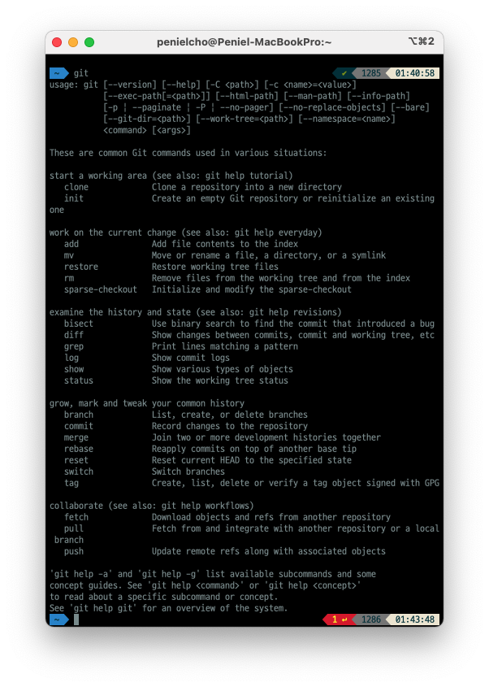
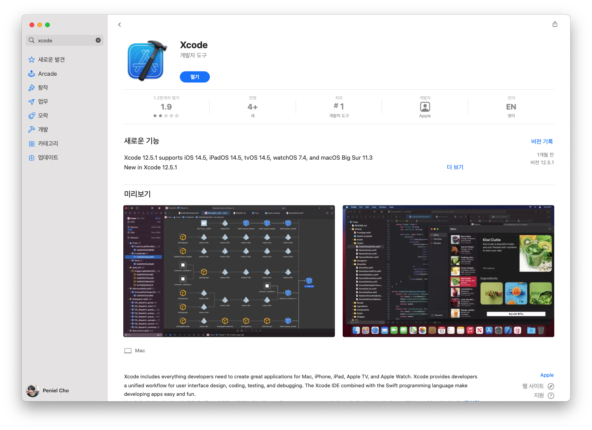
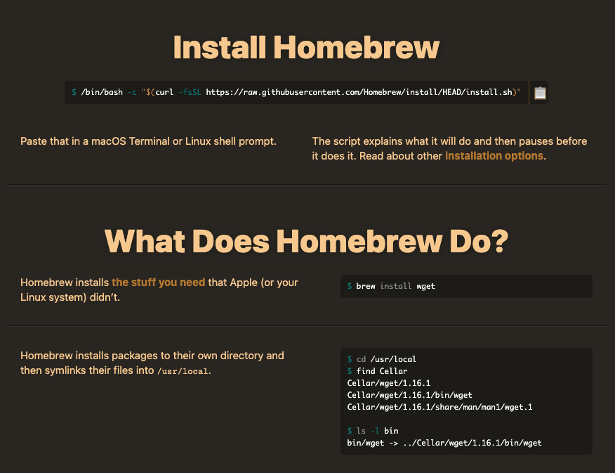

# 맥OS 깃 CLI 환경 세팅

### 깃 설치
터미널에서 git이라고 쳐보세요. 아래와 같이 깃 명령어 관련 안내가 반환되지 않을 경우 맥에 깃이 설치되어 있지 않은 거랍니다.


맥에서 깃을 설치하는 방법은 다양하지만 다음 두 방법이 가장 쉽습니다.
#### 1. Xcode 앱 설치하기
개인적으로 추천하는 방법입니다. Xcode는 애플 기기에서 사용가능한 어플리케이션의 개발을 돕는 소프트웨어에요. Xcode 내에는 다양한 언어 및 모듈이 설치되어 있고, 그 중엔 Git도 포함됩니다. 11기가로 용량이 꽤나 크지만 앱스토어에서 설치만 하면 되니 패스가 꼬이는 등의 염려도 없고 간단하죠. 나중에 Swift(애플 개발 언어)를 사용하게 될 수도 있고요. 앱스토어를 통한 설치가 완료되면 Xcode를 한번 실행시켜 준 후 종료하고, 터미널에서 다시 git을 쳐보세요. 명령어 안내가 잘 뜨면 깃 설치 완료입니다. Xcode의 거대한 용량이 걱정된다, 하는 분들은 2번 방법을 사용해봅시다.

#### 2. homebrew를 통해 설치하기
homebrew는 소프트웨어 설치를 돕는 오픈소스 소프트웨어 패키지 관리 툴입니다. 앞으로 계속 개발을 하신다면 npm, yarn과 함께 자주 볼 친구이니 이 기회에 설치해두면 좋습니다. 이제 저희는 homebrew를 통해 git을 설치해 볼 겁니다.

1. 터미널에 아래코드를 입력해주면 homebrew 설치가 완료됩니다.
    ```
    /bin/bash -c "$(curl -fsSL https://raw.githubusercontent.com/Homebrew/install/HEAD/install.sh)"
    ```

    

    (참고:  [공식 홈페이지](https://brew.sh/))

2. 터미널에 brew install git을 입력해주세요.
3. 설치가 완료되었는지 확인하기 위해 터미널에 git을 입력해보세요. 깃 명령어 안내가 나올 경우 올바르게 깃이 설치된 거랍니다.

#### 깃헙 등 추가 환경 세팅에 관해
깃헙 레포지토리 생성 방법, 오프라인 작업 폴더와 깃헙 레포지토리 연결 방법 등은 [깃 필수 명령어](./git-commands.md), [깃헙 필수 기능](./github-must-know-features.md) 내용에 포함되어 있으니 해당 파트를 참고해주세요.