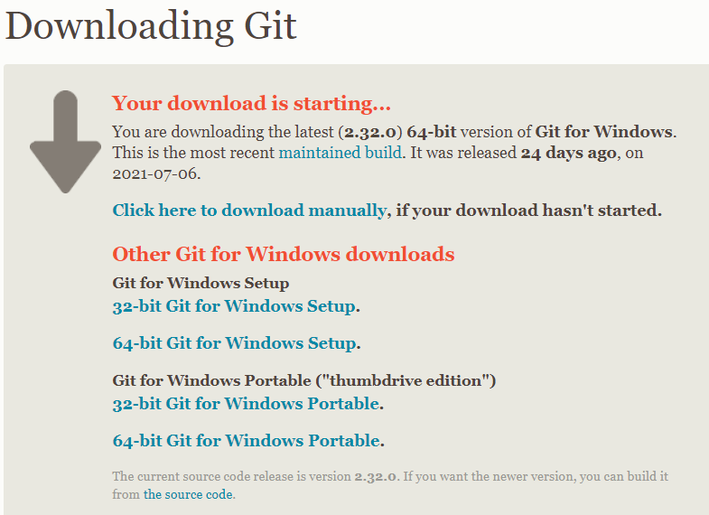
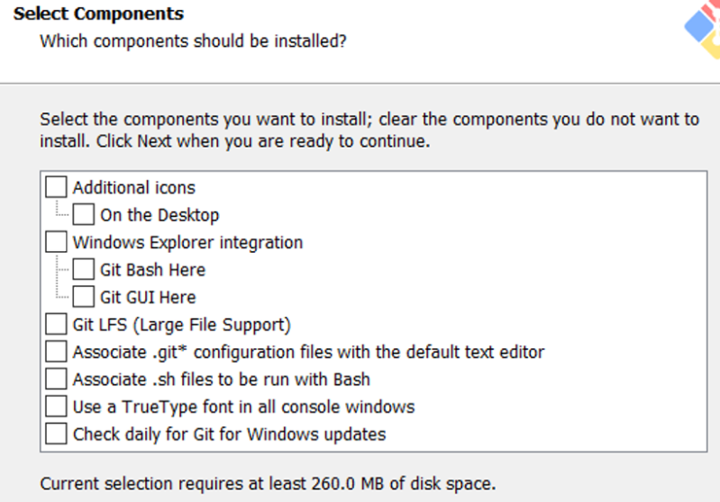
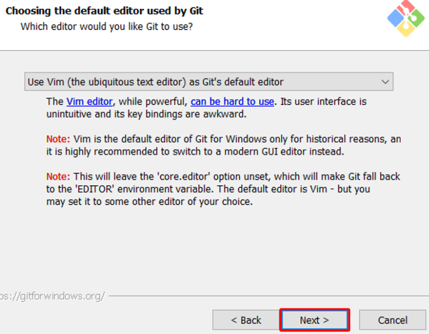
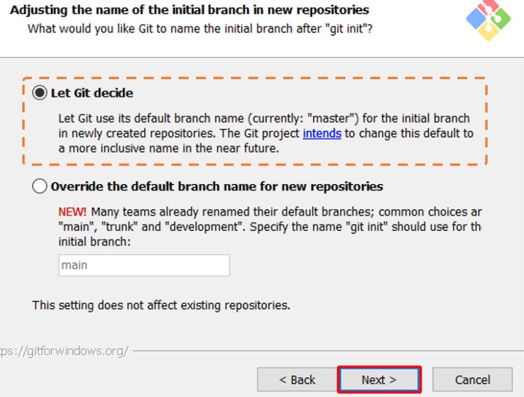
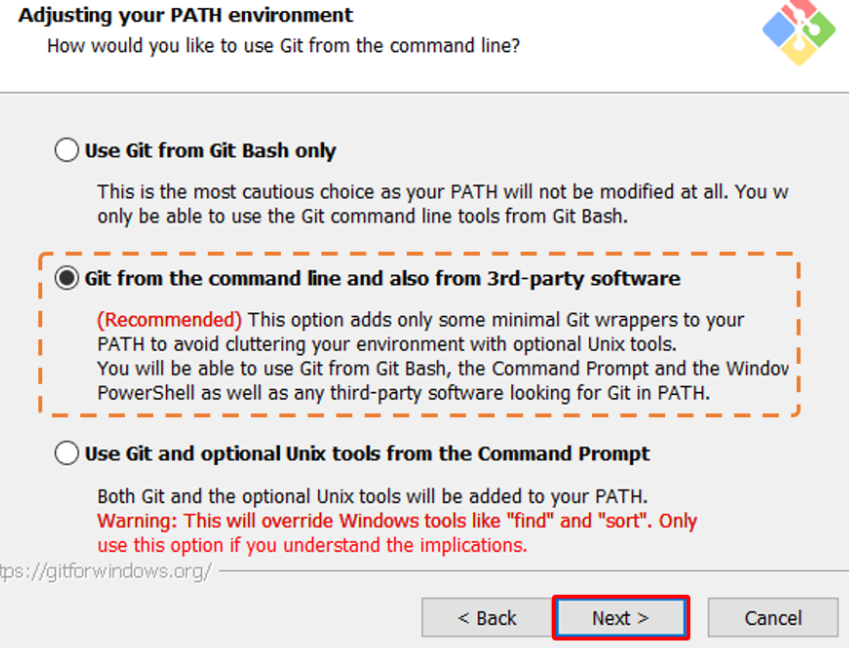
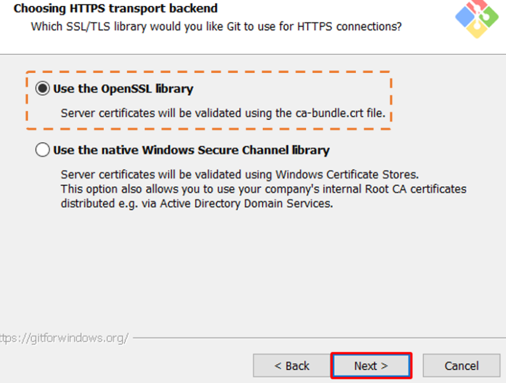
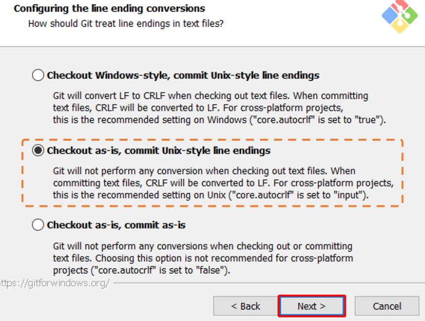
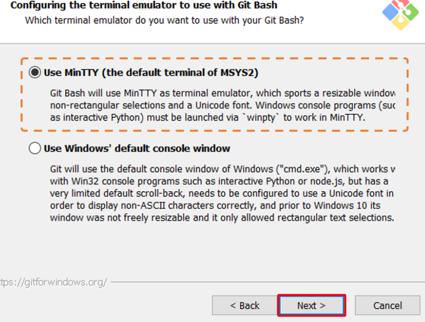
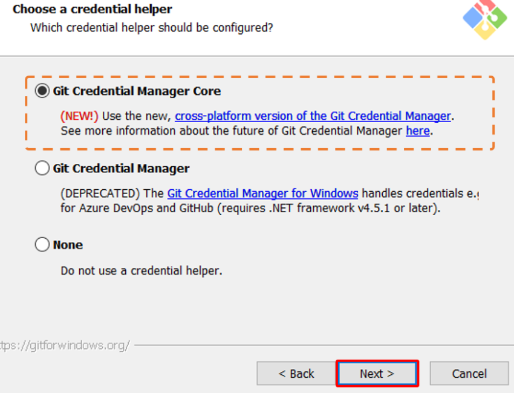
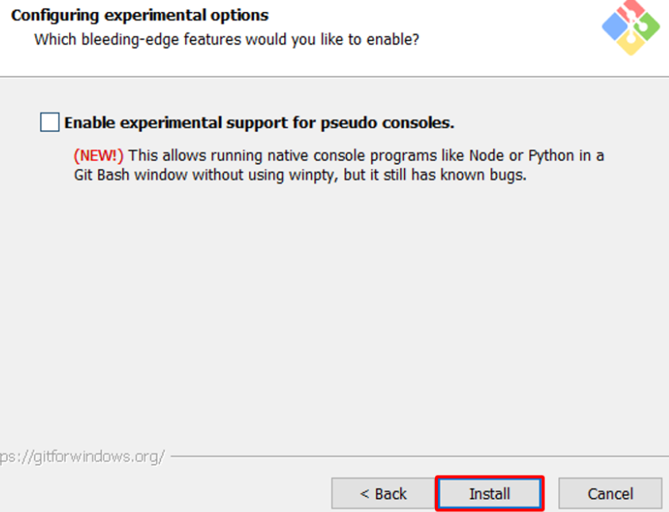

## Windows 컴퓨터 Git 설치하기
깃을 배우기 전에 컴퓨터에 깃을 설치해야겠죠? 지금부터 설치를 해볼게요! 제가 참고한 자료는 밑에 링크를 첨부하였으며 Windows10 Pro, Git 2.30.1 설치환경을 바탕으로 설치하였습니다. 이 점 참고해주시면 되겠습니다 😆   

[Windows 컴퓨터 Git 설치하기](https://velog.io/@saakmiso/Windows-%EC%BB%B4%ED%93%A8%ED%84%B0-Git-%EC%84%A4%EC%B9%98%ED%95%98%EA%B8%B0)   
[Git 설치](https://git-scm.com/book/ko/v2/%EC%8B%9C%EC%9E%91%ED%95%98%EA%B8%B0-Git-%EC%84%A4%EC%B9%98)   

추가적으로 git 홈페이지에 있는 설치 부분도 혹시나 하여 첨부합니다. 안에 공식문서도 있어서 추가 공부하실 때 읽어보셔도 도움이 될거에요! 🤩 자~ 그럼 이제 본격적으로 시작해볼게요. 먼저 Git을 다운로드 해야겠죠?   
[Git](https://git-scm.com/)   
위의 링크를 누르시고 페이지에 들어가면 있는 Download 버튼을 누르고, Windows를 선택해줄게요.   

   
들어가면 자신의 컴퓨터 버전 (32bit, 64 bit)에 따라 설치할 수 있는 링크가 떠 있을 거에요~ 자신의 컴퓨터 버전을 확인하신뒤 Git 설치 프로그램을 다운받아주고, 설치를 합니다 😉 Setup 창이 뜨면 next를 눌러주시고, 경로 설정을 해주세요. 특별한 문제가 없으면 기본 경로로 설치해주시면 됩니다. 다음으로 편의기능 설치 여부가 나오는데, 읽어보시고 체크해주시면 되고, 설치를 하지 않으셔도 무방합니다. 편의기능에 대한 자세한 설명은 링크에 첨부되어 있습니다.

   
기본 편집기도 Vim으로 설정되어 있는데 변경하시지 않아도 됩니다.   

   
$ git init이라는 명령어를 치면 생성되는 브랜치의 초기이름을 다음과 같이 설정합니다.   

   
다음으로 환경변수는,   

   
보안 서버를 접속하기 위한 방법으로는,   

   
텍스트 파일에서 줄 끝 부분 처리에 관해서는,   

   
터미널 에뮬레이터로는,   

   
Credential Helper은 데이터 통신에 HTTP 프로토콜을 사용 시, 매번 입력해야 하는 인증정보를 저장하고 자동으로 입력해주는 시스템을 이야기합니다. 이것의 설치는 다음과 같이 설정합니다!   

   
기타 설정은,   

   
마지막으로,   

   

세팅을 완료했으면 자동 설치가 됩니다. 설치한 환경 중에서는 Git Bash를 가장 많이 사용하고, 간단한 것들은 깃헙 데스크탑으로도 쉽게 이용할 수 있답니다 😊 설정해야 하는 화면만 캡쳐해서 이 글을 작성하였는데, 이것과 관련한 세부적인 설명이나 옵션 설정을 하고 싶으신 분들은 제가 참고한 링크를 들어가셔서 같이 보시면 될 것 같습니다. 시작이 반이라고 하는데, 저희는 설치가 반이라고 할 수 있겠네요 ㅎㅎ 깃을 설치했으니 저희 커리의 반은 왔다고 볼 수 있어요! 그럼 계속해서 깃에 관해서 배워보도록 할게요 😎   
   
   
## 깃헙 데스크탑 설치하기   

깃헙 데스크탑을 설치하기 위해서는 밑 링크(설치하기 버튼)로 들어가셔서 자신의 컴퓨터 버전(32, 64bit)에 맞추어 설치해주시면 됩니다~ 간단하죠? 🙂 CLI(커맨드라인)에 익숙하지 않은 분들은 데스크탑 버전으로 익히는 것도 깃과 친해질 수 있는 하나의 방법이랍니다~   [GitHub Desktop 설치하기](https://desktop.github.com/)
