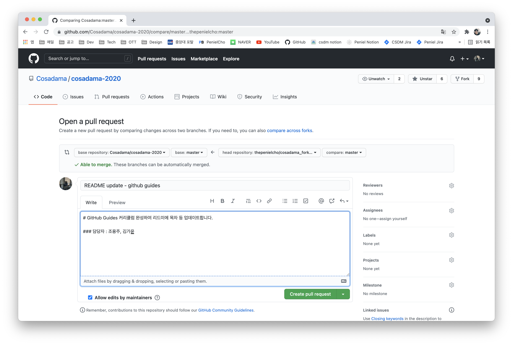

# 깃헙 필수 기능

### create repository
자신의 깃헙 프로필에 들어와 Repositories 섹션을 누르면 우측 상단에 New 버튼이 있습니다. 해당 버튼을 누르면 새로운 레포지토리를 만들 수 있습니다. 혹은 우측 상단 + 버튼을 눌러도 New Repository 옵션을 클릭해 새로운 레포지토리를 만들 수 있습니다.

해당 버튼들을 누르면 아래와 같은 화면이 나타납니다. 아래 페이지에서는 레포지토리 이름과 설명, 공개 여부, 각종 파일 및 라이센스 설정이 가능합니다.

### fork
타인의 레포지토리를 자신의 레포지토리로 복사해올 때 사용하는 기능입니다. 아래 사진에서 fork 버튼을 누르면 실행됩니다.

fork 기능이 실행되면 아래와 같이 자신의 레포지토리에 원본 레포지토리와 동일한 복사본 레포지토리가 생깁니다. 레포지토리용 Clone 명령어와 비슷하다고 생각하셔도 될 것 같네요.

fork한 레포지토리는 오리지널 레포지토리와 연결 되어 있어 최신으로 업데이트(fetch and merge)하거나 새로운 변화를 제안(pull request)할 수도 있어요.

### fetch and merge
레포지토리를 fork한 상황에서 오리지널 레포지토리에 새로운 커밋이 추가된 경우, 해당 커밋(버전)을 fork된 레포지토리에도 적용시키기 위해서는 fetch and merge를 해줘야 합니다. 이를 위해서는 우측 상단의 fetch upstream 버튼을 눌러줘야 합니다. 실제로 오리지널 레포지토리가 앞서 있는 경우 좌측 메시지를 통해 몇 커밋이 앞서 있는지 알 수 있으며 fetch and merge 버튼이 활성화되어 커밋을 fork된 레포지토리에도 적용 가능합니다.

fetch and merge가 성공한 경우 아래와 같이 오리지널 레포지토리와 동등(even)한 상태가 됩니다.

### pull request
fork한 레포지토리에서의 변경 사항(커밋)을 오리지널 레포지토리에 적용하고 싶은 경우 사용하는 기능입니다. 로컬 폴더(Working Directory)에서 fork된 레포지토리로 커밋 및 푸쉬를 완료한 경우 아래와 같이 오리지널 레포지토리에 앞서 있다는 표시가 뜹니다. 

또한 contribute 내 open pull request 버튼이 활성화됩니다. 해당 버튼을 눌러주세요.

이 경우 위와 같이 create pull request 버튼이 뜹니다. 역시 눌러주세요. 

그 다음으로 pull request에 대한 코멘트를 작성합니다. 코멘트는 앞서 배운 마크다운 문법으로 작성합니다. 코멘트까지 완료한 후 create pull request를 누르면 pull request(소위 풀리퀘) 완료!

### merge
pull request를 오리지널 레포지토리에 적용하는 기능입니다. 당연한 이야기지만, merge하기 위해서는 해당 레포지토리에 대한 권한(access)이 있어야 합니다. pull request에 대한 merge는 결국 commit and push니까요.

pull request가 생성된 경우 오리지널 레포지토리의 pull requests 섹션에 알림이 뜹니다.

클릭해보면 pull request에 대한 내용이 있고, 오리지널 레포지토리의 기존 파일들과 충돌하지의 여부를 알려주네요. 저희는 충돌, 에러 가능성이 없다고 하니 merge해줄게요.

merge 이후 보라색으로 merged, 아래에 pull request closed가 나타난다면 pull request에 대한 merge가 성공적으로 완료되었다는 뜻입니다.