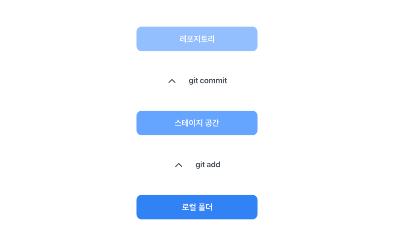

# 로컬에서 스테이지로, 스테이지에서 레포지토리로

### 용어 설명
- commit : 파일들의 변화를 묶은 덩어리라고 보면 쉬워요. 이 덩어리 하나가 하나의 '버전'을 만들게 돼요.
- Working Directory : 작업 공간, 즉 작업 중인 파일들을 담은 로컬 컴퓨터 폴더를 말해요.
- Staging Area : 다음 커밋에 포함될 요소들이 모인 곳으로, 커밋 전 대기 공간으로 이해하면 쉬워요. 가시화되지 않는 가상 공간입니다.
- Repository : 모든 커밋의 집합소에요. 클라우드 서비스 내 프로젝트 단위로 보면 편해요.

### 스테이지로, 레포지토리로!

#### 1. 로컬 폴더 > 스테이지 공간
커밋을 통해 하나의 버전을 만들기 위해서는 반드시 준비 과정이 필요해요. 바로 스테이지 공간(Staging Area)을 거치는 과정이죠. 하나의 커밋은 다양한 파일들을 포함하고, 커밋 이전 이 파일들의 변화를 임시로 저장해두는 공간이 스테이지 공간이에요. 로컬 폴더(Working Directory)에 있는 파일들의 변화를 스테이지 공간에 저장하는 git 명령어는 git add에요.
#### 2. 스테이지 공간 > 레포지토리
git add를 통해 충분히 의미있는 정도의 변화가 스테이지 공간에 모였나요? 그럼 변화의 덩어리, 즉 커밋을 레포지토리에 업로드해 공유 가능한 하나의 버전을 만들어 봅시다. 스테이지 공간의 변화들을 하나의 덩어리로 묶는 git 명령어는 git commit이에요. 이때 커밋을 레포지토리에 업로드하는 방법은 사실 몇가지가 존재해요. 자세한 git 명령어는 다음 파트 [git 명령어]()에서 배워봅시다.
